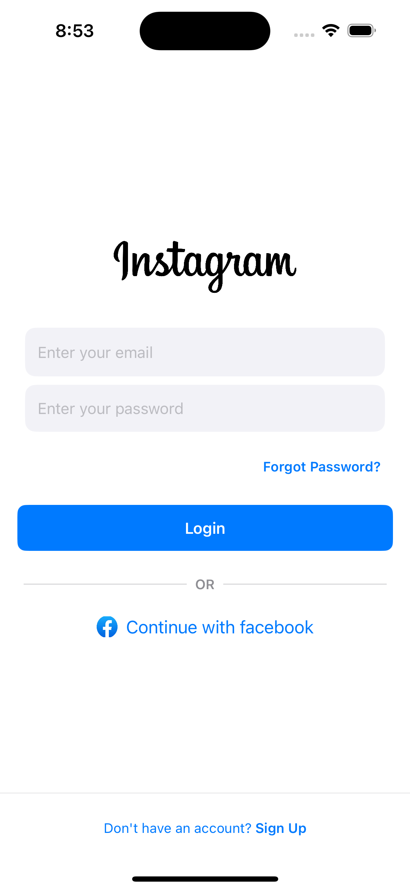
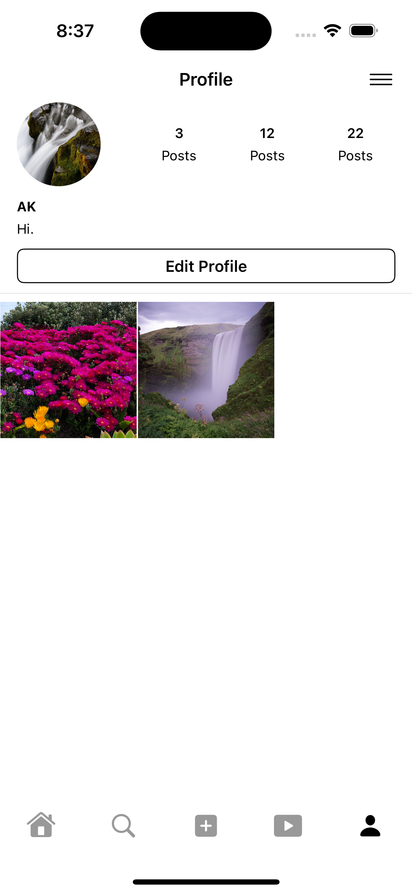

# Instagram Clone

This is an Instagram clone built using SwiftUI for iOS. The app replicates some of the core features of Instagram, including user authentication, photo sharing, and a social feed.

## Features

- User Authentication (Sign Up, Login, Logout)
- Post Upload 
- Social Feed with Posts from Followed Users
- Like and Comment on Posts
- User Profiles
- Search Users
- Edit Profile

## Screenshots


*Login Screen*


*Feed Screen*


*Profile Screen*


*Profile Edit Screen*


*Users Screen*


*Post Upload Screen*

## Requirements

- iOS 14.0+
- Xcode 12.0+
- Swift 5.0+

## Installation

1. Clone the repository:
    ```bash
    git clone https://github.com/yourusername/instagram-clone.git
    ```
2. Navigate to the project directory:
    ```bash
    cd instagram-clone
    ```
3. Open the project in Xcode:
    ```bash
    open InstagramClone.xcodeproj
    ```
4. Run the project on a simulator or a connected device.

## Usage

1. Sign up or log in with your credentials.
2. Start uploading photos by clicking the "Add" button.
3. Interact with other users' posts by liking and commenting.
4. Follow or unfollow users by visiting their profiles.

## Technologies Used

- Swift
- SwiftUI
- UIKit
- Kingfisher
- Firebase (or any backend service you used)
  

## Contributing

Contributions are welcome! Please fork the repository and submit a pull request for any improvements or bug fixes.

## License

This project is licensed under the MIT License - see the [LICENSE](LICENSE) file for details.

## Contact

For any questions or suggestions, feel free to open an issue or contact me directly at dev.swiftnook@gmail.com
